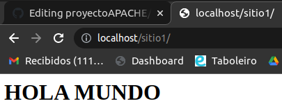

# proyectoAPACHE

Lo primero es crear la carpeta que contendrá todo lo que se quiera hacer.
Mi carpeta "server" contiene las carpetas "sitio1, sitio2, sitio HTTPS y sitioSSL". 

Ahora que está todo ordenado, busco la imagen de apache-php en hub.cokcer.com 
y configuro el **docker-compose.yml** para definir al contenedor.

Por otro lado, también contiene los archivos docker-compose.yml (el cual creo de manera manual 
igual que los demás archivos), info.php, README.md

Dentro del docker-compose.yml declaro el contenedor con su imagen, puerto y volumenes

```
version: "3.3"
services:
 apache-XD:
  container_name: apache-XD
  image: php:7.2-apache
  ports:
    - "80:80"
  volumes:
    - /home/asir2a/Escritorio/SRI/tuto/server:/var/www/html
    - configApache:/etc/apache2
volumes:
  configApache:
```
En ~/server/info.php pongo: 
```
<?php
    phpinfo();
?>
```
Una vez esto está hecho, dentro de sitio1/ creo un archivo llamado index.html en el cual pongo `<h1>hola mundo</h1>`
Ahora lo que hago es ejecutar docker-compose up y en el navegador buscar **localhost:80**

En este localhost/sitio1 aparece por pantalla <h1>hola mundo</h1>



Por otro lado, en localhost/info.php debería aparecer una tabla de información con toda la sálida de la función `phpinfo()`

# Mapeo del Documento Root

Para mapear este documento, hay que hacer un volumen asociado al root en la configuración
del documento docker-compose.yml

```
version: "3.3"
services:
 apache-XD:
  container_name: apache-XD
  image: php:7.2-apache
  ports:
    - "80:80"
  volumes:
    - /home/asir2a/Escritorio/SRI/tuto/server:/var/www/html
  **- configApache:/etc/apache2**
volumes:
 **configApache:**
```
Lo próximo que se debe hacer es ir al apartado de volúmenes del VCode y seleccionar server_configApache con el clic derecho y abrirno en un Dev Container.
Una vez allí, se puede descargar toda la configuración necesaria a la carpeta del server si así se quiere.


# Solución de errores.

En docker-compose.yml había que poner lo siguiente

```
version: "3.3"
services:
 apache-XD:
  container_name: asir_apache
  image: php:7.2-apache
  ports:
    - "80:80"
  volumes:
    - /home/asir2a/Escritorio/SRI/tuto/server/html:/var/www/html:ro
    - /home/asir2a/Escritorio/SRI/tuto/server/apache2:/etc/apache2
volumes:
  configApache:

```
Lo único que había que hacer es configurar la segunda línea de volumes: para que mapee la configuración que se ha modificado de apache.

# Implementación del servicio DNS

Para implementar el servicio DNS al servidor apache hay que modificar el archivo docker-compose.yml:

```
version: "3.3"
services:
 apache-XD:
   (...)
   networks:
      bind9_subnet:
        ipv4_address: 10.0.1.253 (IP fija del contenedor)
 asir_bind9:
   container_name: asir_bind9
   image: internetsystemsconsortium/bind9:9.16
   ports:
     - 5300:53/udp
     - 5300:53/tcp
   volumes:
     - /home/asir2a/Escritorio/SRI/tuto/server/bind9/conf:/etc/bind
     - /home/asir2a/Escritorio/SRI/tuto/server/bind9/zonas:/var/lib/bind
 **networks:**
      bind9_subnet:
        ipv4_address: 10.0.1.254 (IP fija del contenedor)
*DNS_cliente:*
  container_name: dns_server
  image: alpine
  stdin_open: true
  tty: true
  dns:
   - 10.0.1.254
  networks:
    bind9_subnet:
      ipv4_address: 10.0.1.252
networks:
  bind9_subnet:
    external: true
```
Añado al archivo un nuevo contenedor llamado **dns_server** con una imagen alpine.
La subnet del dns la creo con el comando `docker network --subnet 10.0.1.0/24 --gateway 10.0.1.1 bind9_subnet`
El parametro subnet delimita el rango de IPs y el segundo parametro define cual será el gateway. 

También le he asignado a los contenedores apache y alpine unas IPs fijas dentro de la subred creada.

Por último, "bind9_subnet" es el nombre de la subnet.

Esta subnet es la que usa el contenedor de DNS en el apartado: 
```
**networks:**
      bind9_subnet:
        ipv4_address: 10.0.1.254
```

**Docker-compose.yml: DNS_cliente**

Esta parte del código del archivo.yml define los parametros de imagen, subnet, dns y red usada.
```
*DNS_cliente:*
  container_name: dns_server
  image: alpine
  stdin_open: true
  tty: true
  dns:
   - 10.0.1.254
  networks:
    bind9_subnet:
      ipv4_address: 10.0.1.252
networks:
  bind9_subnet:
    external: true
```

## Creación de la carpeta bind9 / conf / zonas

Ahora que está el .yml configurado, es momento de crear las carpetas necesarias para emplear el DNS.
`mkdir bind9` `mkdir bind9/conf` `touch named.conf named.conf.local named.conf.options` `mkdir bind9/zonas` `touch db.asircastelao.com`
Dentro del archivo ***named.conf***:
`include "/etc/bind/named.conf.options";`
`include "/etc/bind/named.conf.local";`
Esto sirve para dividir la configuración en dos archivos, uno encargado de las **zonas** y el otro encargado del **forwarding**.

## Configuración de db.fabulas.com

El archivo se encarga de **determinar las IPs de la subred** por lo que una vez estas sean asignadas, se deberían poder hacer ping entre los contenedores **apache** y **alpine**.
## Configuración para resolver nombres "ns.fabulas.com":

Dentro del archivo **named.conf.local**:
```
zone "fabulas.com"  {
    type master;
    file "/var/lib/bind/db.fabulas.com";
    allow-query {
        any;
     };
};
```

Dentro del archivo **named.conf.options**:
```
options{
    directory "/var/cache/bind";

    forwarders {
        8.8.8.8;
        8.8.4.4;
    };
    forward only;

    listen-on { any; };
    listen-on-v6 { any; };
    allow-query {
        any;
    };
};
```

Dentro del archivo **db.fabulas.com**:

*ns IN A 10.0.1.254 => DNS cuyo contenedor tiene esta IP*
*maravillosas IN A 10.0.1.253 => APACHE cuyo contenedor tiene esta IP*
*oscuras IN A 10.0.1.253 => APACHE cuyo contenedor tiene esta IP*
```
$TTL    3600
@       IN      SOA     ns.fabulas.com. sromerodiaz.danielcastelao.org. (
                   2022051001           ; Serial
                         3600           ; Refresh [1h]
                          600           ; Retry   [10m]
                        86400           ; Expire  [1d]
                          600 )         ; Negative Cache TTL [1h]
;

@       IN      NS      ns.fabulas.com.
@       IN      MX      10 sromerodiaz.danielcastelao.org.

ns      IN      A       10.0.1.254
maravillosas      IN      A       10.0.1.253
oscuras      IN      A       10.0.1.253
```

Dentro del archivo **000-default.conf**:
```
<VirtualHost *:80>

	ServerName ns.fabulas.com.

	ServerAdmin webmaster@localhost
	DocumentRoot /var/www/html/sitio1


	ErrorLog ${APACHE_LOG_DIR}/error.log
	CustomLog ${APACHE_LOG_DIR}/access.log combined

</VirtualHost>
```

## Comprobación del funcionamiento:
